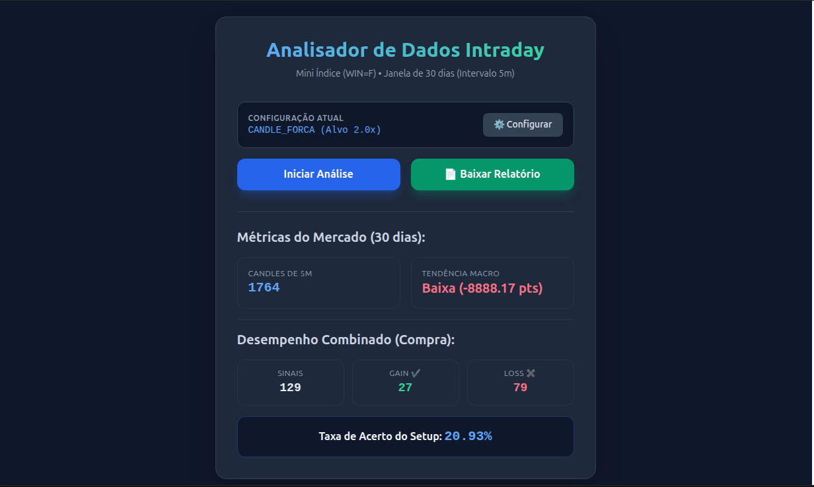

# HELP_TRADER

Ferramenta de apoio a analise gráfica para validar estratégias daytrade.


## 📋 Sobre o Projeto

**HELP_TRADER** é uma ferramenta web desenvolvida para apoiar analistas e traders na validação e análise de estratégias de day trading. A aplicação fornece visualizações gráficas interativas e recursos analíticos para testar e refinar estratégias de negociação.

## 🎯 Objetivo

Validar e analisar estratégias de day trading customizadas através de uma interface gráfica intuitiva e ferramentas de análise técnica.

## 📈 Evolução

- **Busca de dados**: Extrair dados da bolsa de valores.
- **Aplicar estrategias de trayde**: Utilizar estratégias renomadas como gatilho de entrada das operações.
- **Combinar estratégias**: Possibilitar utilização de varias estratégias em conjunto (aumento da acertividade)
- **Analise quantitativa**: Analizar relação Gain Loss no período.
- **Relatório PDF**: Emitir relatório para registro de evolução das estratégias. [Relatórios](docs/Relatórios)

## 🛠️ Tecnologia

- **Backend**: Python Flask
- **Linguagem Principal**: Python (98.7%)
- **Linguagens Auxiliares**: HTML, CSS, JavaScript
- **Frontend**: Tailwind CSS

## 🚀 Funcionalidades

- Análise gráfica de séries temporais de preços
- Validação de estratégias de day trading
- Visualização interativa de dados de mercado
- Otimização de estratégias customizadas

## 📦 Requisitos

- Python 3.8+
- Flask
- Dependências adicionais listadas em `requirements.txt`

## 🔧 Instalação

1. Clone o repositório:
```bash
git clone https://github.com/EbonyWizard4/HELP_TRADER.git
cd HELP_TRADER
```

2. Crie um ambiente virtual:
```bash
python -m venv venv
source venv/bin/activate  # No Windows: venv\Scripts\activate
```

3. Instale as dependências:
```bash
pip install -r requirements.txt
```

## 🏃 Como Usar

1. Ative o ambiente virtual
2. Execute a aplicação Flask:
```bash
python app.py
```

3. Acesse a aplicação no navegador:
```
http://localhost:5000
```

## 📁 Estrutura do Projeto

```
HELP_TRADER/
├── app.py                 # Aplicação Flask principal
├── requirements.txt       # Dependências do projeto
├── templates/            # Templates HTML
├── static/              # Arquivos CSS, JavaScript, imagens
├── models/              # Modelos de dados
└── utils/               # Funções utilitárias
```

## 🔄 Fluxo de Trabalho

1. **Carregamento de Dados**: Importe dados históricos de preços
2. **Configuração de Estratégia**: Defina os parâmetros da sua estratégia
3. **Análise Gráfica**: Visualize os resultados da estratégia
4. **Validação**: Avalie a performance e ajuste conforme necessário
5. **Otimização**: Refine os parâmetros para melhores resultados

## 📊 Análises Disponíveis

- Gráficos de preço (OHLC)
- Indicadores técnicos
- Sinais de entrada/saída
- Métricas de performance

## 🤝 Contribuindo

1. Faça um fork do projeto
2. Crie uma branch para sua feature (`git checkout -b feature/nova-funcionalidade`)
3. Commit suas mudanças (`git commit -am 'Adiciona nova funcionalidade'`)
4. Push para a branch (`git push origin feature/nova-funcionalidade`)
5. Abra um Pull Request

## ⚠️ Aviso Importante

Esta ferramenta é destinada a fins educacionais e de pesquisa. O trading em mercados reais envolve riscos significativos. Use por sua conta e risco, e sempre teste estratégias completamente antes de utilizá-las em operações com dinheiro real.

## 📝 Licença

[Adicione informações de licença aqui]

## 👤 Autor

**EbonyWizard4**

## 📞 Contato e Suporte

Para dúvidas, sugestões ou problemas, abra uma [issue](https://github.com/EbonyWizard4/HELP_TRADER/issues) no repositório.

---

**Última atualização**: Junho de 2026
